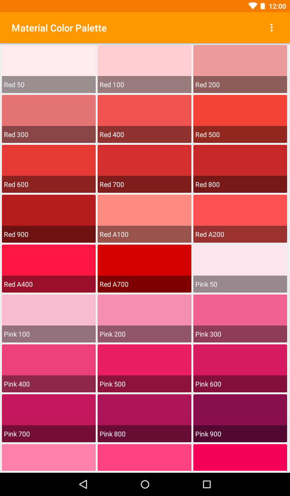
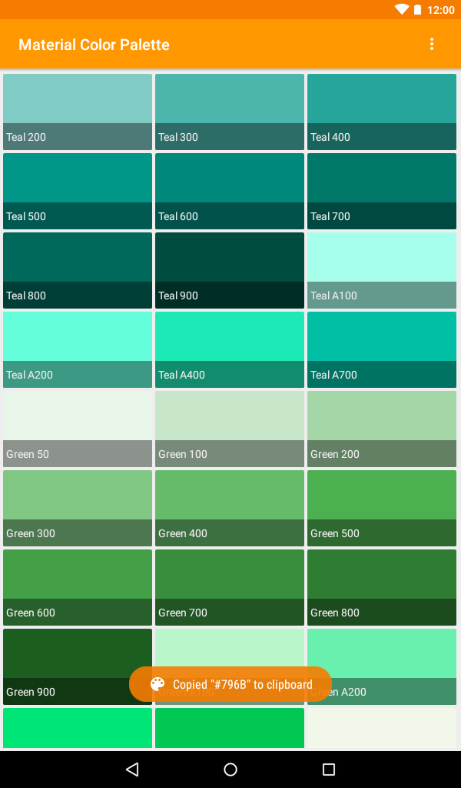

# Material Color Palette Library
<a href="https://travis-ci.com/characterdog/materialcolor/"></a> <a title="Crowdin" target="_blank" href="https://crowdin.com/project/materialcolor"></a>

Use material colors in your project with ease: Instead of manually looking up the hexcodes, use `@color/material_color_orange_500`.

## Installation

Add this to your project's gradle file:

```gradle
allprojects {
    repositories {
        maven { url 'https://jitpack.io' }
    }
}
```

```gradle
dependencies {
    compile 'com.github.characterdog:materialcolor:1.0'
}
```

## Demo app

[](https://f-droid.org/app/com.github.characterdog.materialcolor)
[](https://play.google.com/store/apps/details?id=com.github.characterdog.materialcolor)

 

### Translations

Translations are managed via [Crowdin](https://crowdin.com/project/materialcolor). Translations need to be approved before I can merge them. Please do not hesitate to contact me via Crowdin or GitHub issue if you want to become proofreader or if you want to request a language.

## License

Both, app and library, are published under [GNU General Public License v3.0 or later](https://spdx.org/licenses/GPL-3.0-or-later.html).


Google Play and the Google Play logo are trademarks of Google LLC.
